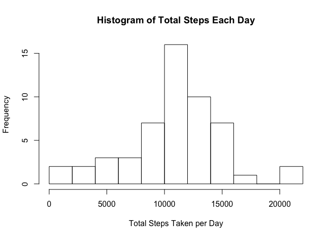
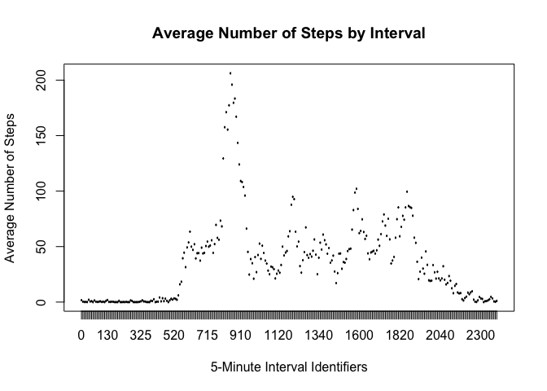
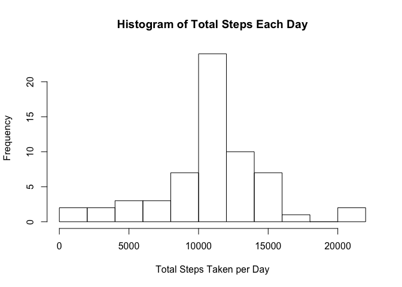
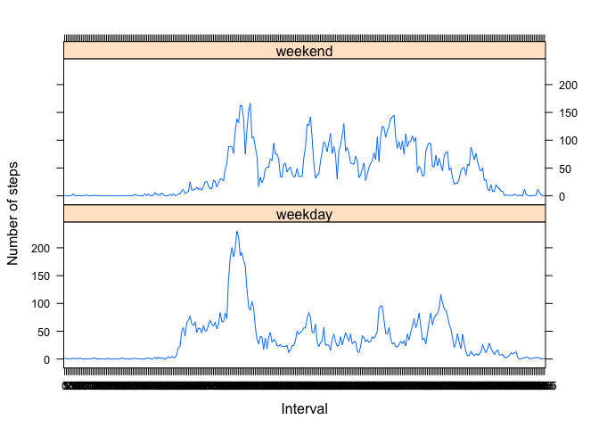

# Reproducible Research: Peer Assessment 1


## Loading and preprocessing the data
1. Loading the necessary libraries

```r
library(knitr)
library(dplyr)
```

```
## 
## Attaching package: 'dplyr'
```

```
## The following objects are masked from 'package:stats':
## 
##     filter, lag
```

```
## The following objects are masked from 'package:base':
## 
##     intersect, setdiff, setequal, union
```

```r
library(lattice)
```
2. Loading and preprocessing the data

```r
d0 <- read.csv("activity.csv", header=TRUE, na.strings="NA")
d0$date <- as.Date(d0$date, "%Y-%m-%d")
d0$interval <- as.factor(d0$interval)
```
## What is mean total number of steps taken per day?
1. This code calculates total number of steps taken per day.

```r
bydate0 <- d0 %>% 
              group_by(date) %>% 
              summarize (total = sum(steps))
```
2. This code makes a histogram of the total number of steps taken each day.

```r
hist (bydate0$total, 
      main="Histogram of Total Steps Each Day", 
      xlab="Total Steps Taken per Day", 
      breaks= 10)
```

<!-- -->

```r
s0 <- summary(bydate0$total)
print (s0)
```

```
##    Min. 1st Qu.  Median    Mean 3rd Qu.    Max.    NA's 
##      41    8841   10765   10766   13294   21194       8
```
3. The mean total number of steps taken each day is 1.0765\times 10^{4} and median total number of steps taken each day is 1.0766189\times 10^{4}.

## What is the average daily activity pattern?
1. Below is a time series plot of the 5-minute interval and the average number of steps taken, averaged across all days.

```r
byint <- d0 %>% 
          group_by(interval) %>% 
          summarize (average=mean(steps, na.rm=TRUE))
mx <- which(byint$average==max(byint$average))
plot (byint$interval, byint$average, 
      type="l", 
      xlab="5-Minute Interval Identifiers", 
      ylab="Average Number of Steps", 
      main="Average Number of Steps by Interval")
```

<!-- -->

2. 835 is the 5-minute interval that contains the maximum number of steps (206.1698113) on average across all the days.

## Imputing missing values
1. This code calculates the total number of incomplete rows, or total rows with NA/missing values.

```r
na0 <- sum(!complete.cases(d0))
print(na0)
```

```
## [1] 2304
```
There are 2304 rows with NA values.

2. The missing values in the dataset will be filled with the mean number of steps for that particular 5-minute interval.

3. This code creates a new dataset equal to the original dataset but with the missing data filled in.

```r
d1 <- d0
for ( n in 1:nrow(d1) ) {
    if ( is.na (d1[n,1]) ) ( 
          d1[n,1]<-byint$average[which(byint$interval==d1[n,3])]        )
}
head(d1)
```

```
##       steps       date interval
## 1 1.7169811 2012-10-01        0
## 2 0.3396226 2012-10-01        5
## 3 0.1320755 2012-10-01       10
## 4 0.1509434 2012-10-01       15
## 5 0.0754717 2012-10-01       20
## 6 2.0943396 2012-10-01       25
```

```r
head(d0)
```

```
##   steps       date interval
## 1    NA 2012-10-01        0
## 2    NA 2012-10-01        5
## 3    NA 2012-10-01       10
## 4    NA 2012-10-01       15
## 5    NA 2012-10-01       20
## 6    NA 2012-10-01       25
```

4. Below is a histogram of the total number of steps taken each day (using the dataset with missing values filled in).

```r
bydate1 <- d1 %>% 
            group_by(date) %>% 
            summarize (total=sum(steps))
hist (bydate1$total, 
      main="Histogram of Total Steps Each Day", 
      xlab="Total Steps Taken per Day", 
      breaks=10)
```

<!-- -->

```r
s1 <- summary(bydate1$total)
print(s1)
```

```
##    Min. 1st Qu.  Median    Mean 3rd Qu.    Max. 
##      41    9819   10766   10766   12811   21194
```
The mean total number of steps is 1.0766189\times 10^{4} and median total number of steps taken each day is 1.0766189\times 10^{4}. 

The mean and median (with NA values filled in) do not differ significantly compared to the first histogram without NA values. Imputing missing data on total daily number of steps does not seem to have a big impact.

## Are there differences in activity patterns between weekdays and weekends?
1. This code adds a new factor variable to the dataset with two levels, "weekday" and "weekend" indicating whether the given date is a weekday or weekend day.

```r
d1 <- mutate(d1, typeday=weekdays(date))
d1$typeday <- gsub("Sunday|Saturday", "weekend", d1$typeday)
d1$typeday <- gsub("Monday|Tuesday|Wednesday|Thursday|Friday", "weekday", d1$typeday)
d1$typeday <- as.factor(d1$typeday)
```

2. This code constructs a panel plot containing a time series plot of the 5-minute interval and the average number of steps taken, averaged across all weekday days or weekend days.

The panel plot shows that there are some differences in activity patterns between weekend day and weekday.

```r
bytday<- d1 %>% 
          group_by(interval, typeday) %>% 
          summarize (average=mean(steps))
xyplot(average~interval|typeday,
       data=bytday, 
       layout=c(1,2), 
       type="l", 
       ylab="Number of steps",
       xlab="Interval")
```

<!-- -->
